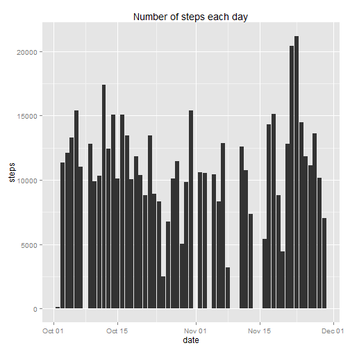
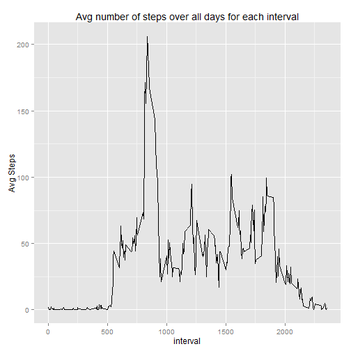
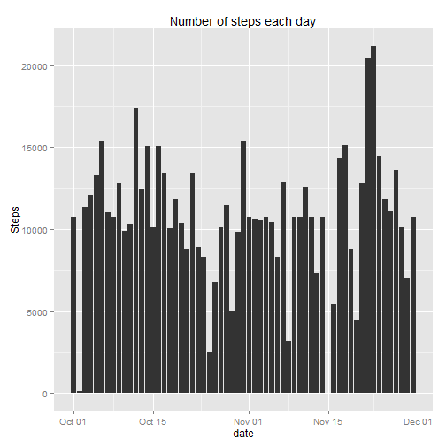
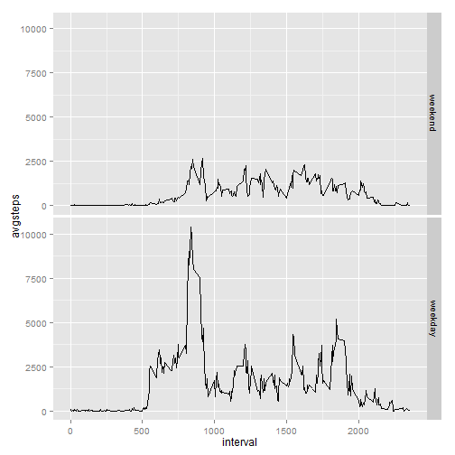

# Reproducible Research: Peer Assessment 1
Note: The data file repdata-data-activity.zip should be present in working directory.

## Loading and preprocessing the data


```r
library(data.table)
#Read data from csv file into data table
data = data.table(read.csv(unzip("repdata-data-activity.zip")))
#convert date variable from character type to date type
data = transform(data, date = as.Date(date, "%Y-%m-%d"))
```

## What is mean total number of steps taken per day?

### 1. Histogram of the total number of steps taken each day


```r
#remove missing values from dataset
actdata = data[complete.cases(steps),]

# plot histogram
library(ggplot2)
with(actdata, qplot(date, steps, geom="histogram", stat="identity", main = "Number of steps each day"))
```

 

### 2. Mean and Median of number of steps taken per day


```r
# Calculate total number of steps for each day
stepsperday = actdata[ , sum(steps), by=date]

# Mean of number of steps taken per day 
mean(stepsperday$V1)
```

```
## [1] 10766
```

```r
# Median of number of steps taken per day
median(stepsperday$V1)
```

```
## [1] 10765
```

## What is the average daily activity pattern?

### 1. Plot of the 5-minute interval (x-axis) and the average number of steps taken, averaged across all days (y-axis)


```r
# Calculate number of steps taken, averaged across all days
AvgStepPerDayForInterval = actdata[, sum(steps)/sum(!is.na(date)), by=interval]
setnames(AvgStepPerDayForInterval, "V1", "avgsteps")
# Plot
with(AvgStepPerDayForInterval, qplot(interval, avgsteps, geom = "line", 
                                    main = "Avg number of steps over all days for each interval", 
                                    ylab = "Avg Steps"))
```

 

### 2. Maximum number of steps for 5-minute interval, on average across all the days in the dataset 


```r
# Maximum number of steps
AvgStepPerDayForInterval[(AvgStepPerDayForInterval$avgsteps == max(AvgStepPerDayForInterval$avgsteps)), ]
```

```
##    interval avgsteps
## 1:      835    206.2
```
## Imputing missing values

### 1. Total number of missing values in the dataset

```r
# Missing values
sum(!complete.cases(data))
```

```
## [1] 2304
```

### 2 & 3 Fill the missing values

Input the missing values with the mean of steps for each interval.


```r
# Create new column m to dataset which will contain mean of steps for each interval
actdata = data[, m:= mean(steps, na.rm = TRUE), by = interval]
# Create new column newsteps which will contain double type value of steps
actdata = actdata[ , newsteps:= as.double(steps)]
# Replace NA (missing) values in newsteps with mean value in m column
actdata = actdata[!complete.cases(newsteps), newsteps:= m]
```

### 4a. Histogram of the total number of steps taken each day

```r
# plot histogram
with(actdata, qplot(date, newsteps, geom="histogram", stat="identity", 
                    main = "Number of steps each day", ylab = "Steps"))
```

 

### 4b. Mean and Median of number of steps taken per day


```r
# Calculate total number of steps for each day
stepsperday = actdata[ , sum(newsteps), by=date]

# Mean of number of steps taken per day
mean(stepsperday$V1)
```

```
## [1] 10766
```

```r
# Median of number of steps taken per day
median(stepsperday$V1)
```

```
## [1] 10766
```

After inputting missing values, new mean and median do not differ much from original values above.

## Are there differences in activity patterns between weekdays and weekends?

### 1. Factor variable in the dataset with two levels - "weekday" and "weekend" indicating whether a given date is a weekday or weekend day

```r
# add new column day to hold name of day derived from date
actdata = actdata[ , day:= weekdays(date)]

# add new column dayofweek to hold values weekend or weeday derived from day
actdata = actdata[day == "Sunday" | day == "Saturday", dayofweek:= "weekend"]
actdata = actdata[!(day == "Sunday" | day == "Saturday"), dayofweek:= "weekday"]
```

### 2.Panel plot containing a time series plot of the 5-minute interval (x-axis) and the average number of steps taken, averaged across all weekday days or weekend days (y-axis).


```r
# calculate average number of steps taken, averaged across all dayofweek for each interval
dataweekday = actdata[, sum(newsteps)/sum(!is.na(dayofweek)), by= c("interval", "dayofweek")]
setnames(dataweekday, "V1", "avgsteps")
# plot 
ggplot(dataweekday, aes(interval, avgsteps)) + geom_line() + facet_grid(dayofweek ~ ., labeller = label_parsed, as.table = FALSE)
```

 

